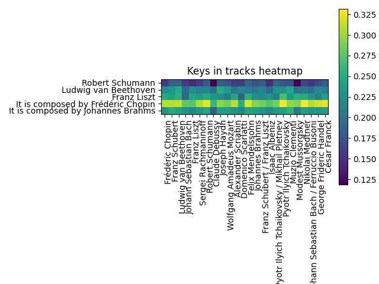

# Przeprowadzone badania dla CLaMP

## Wprowadzenie

Podczas badania CLaMP sprawdzane było jak radzi on sobie z zadaniami wyszukiwania utworu ze zbioru danych do zadanego zapytania tekstowego, wyszukiwanie odpowiadającego tekstu ze zbioru tekstów od podanego utworu oraz wyszukiwanie podobnych utworów od podanego. Aby wykonać te działania przygotowany został zbiór 25 piosenek w postaci mxl. Zostały one przesłuchane oraz opisane tak w pliku after_listening_info.txt zgodnie  tym jak były opisywane utwory w zbiorze [WikiMusicText](https://huggingface.co/datasets/sander-wood/wikimusictext) czyli zbiorze na którym uczony był CLaMP. Zawiera on dane na temat autora/autorów utworu, gatunek oraz początkowe informacje na jego temat znajdujące się na Wikipedii. Po przejrzeniu tego opisu można stwierdzić że nie niesie on istotnej wiedzy takiej jak na przykład nastrój utworu, emocje z nim związane.

 Podczas testów wykorzystane zostały dwa warianty, CLaMP-S/512 oraz CLaMP-S/1024. Pierwszy z nich działał lepiej dla badań, które przeprowadziliśmy.Najpierw sprawdzone zostało jak CLaMP radzi sobie podczas dopasowywania zapytań tekstowych do muzyki. Nie najgorzej dopasowywuje tekst zawierający gatunek do utworu. Trochę gorzej radzi sobie z tekstami opisującymi emocje bądź też informacje takie jak czy dzieło zostało zagrane w filmie, natomiast wśród 5 najbardziej prawdopodobnych utworów często można znaleźć taki który pasuje. Przy podawaniu utworu i dopasowywaniu do odpowiedniego zdania otrzymywane rezultaty czasami były zgodne natomiast nie były one tak dobre jak podczas wcześniejszego badania. Na końcu wykonane zostały porównania utworów.

## Rozwinięcie badań nad embeddingami

Jako rozwinięcie wcześniejszych badań nad embedingami CLaMPa, które sprawdzały wariancję embedingów, wyznaczona została średnia odległość kosinusowa dla danego twórcy i zapytania tekstowego. Przykładowa tabela dla zapytania "It is composed by Johannes Brahms"

|                  Group or author                   | Songs | Avg similar  |
|----------------------------------------------------|-------|--------------|
|                      Everyone                      |  1276 |  0.232241422 |
|                  Frédéric Chopin                   |   201 |  0.228763278 |
|                   Franz Schubert                   |   186 |  0.250301540 |
|                Ludwig van Beethoven                |   146 |  0.242658949 |
|               Johann Sebastian Bach                |   145 |  0.227998613 |
|                    Franz Liszt                     |   131 |  0.217323584 |
|                Sergei Rachmaninoff                 |    59 |  0.230307166 |
|                  Robert Schumann                   |    49 |  0.245009140 |
|                   Claude Debussy                   |    45 |  0.179885443 |
|                    Joseph Haydn                    |    40 |  0.238572886 |
|              Wolfgang Amadeus Mozart               |    38 |  0.237674739 |
|                 Alexander Scriabin                 |    35 |  0.229150356 |
|                 Domenico Scarlatti                 |    31 |  0.215366890 |
|                 Felix Mendelssohn                  |    28 |  0.245764141 |
|                  Johannes Brahms                   |    26 |  0.240885498 |
|            Franz Schubert / Franz Liszt            |    10 |  0.231947316 |
|                   Isaac Albéniz                    |     7 |  0.219790978 |
|     Pyotr Ilyich Tchaikovsky / Mikhail Pletnev     |     6 |  0.236226079 |
|              Pyotr Ilyich Tchaikovsky              |     6 |  0.241343606 |
|                   Muzio Clementi                   |     6 |  0.255861574 |
|                 Modest Mussorgsky                  |     6 |  0.202694252 |
|                  Nikolai Medtner                   |     5 |  0.240970583 |
|      Johann Sebastian Bach / Ferruccio Busoni      |     5 |  0.228982184 |
|               George Frideric Handel               |     5 |  0.232228038 |
|                    César Franck                    |     5 |  0.237573315 |

## Próba wykorzystania embeddingów do uzyskania informacji o metryce

Kolejnym eksperymentem była próba uzyskania wyników odpowiadających jednej z metryk na podstawie embeddingów. Przyjęto miarę głośności z biblioteki WIMU10.
Z datasetu `musicnet` wybrano kilkanaście utworów należących do jednej z grup (określonych metryką):

- utwory ciche (p/mp),
- utwory głośne (mf/f),
- utwory trudne do jednoznacznej klasyfikacji (średnia głośność lub duży zakres dynamiczny)

### Badanie odległości centroid utworów

Przeprowadzono test sprawdzający, czy utwory utworzą klastry w przestrzeni parametrów ukrytych - tj. czy utwory głośne będą blisko siebie a daleko cichych i vice versa.

[tu obrazek]

Wyniki eksperymentu nie doprowadziły do jednoznacznych konkluzji. Nie widać jednoznacznej zależności między dynamiką a centroidami utworów.
Jedynie pliki z ostatniej grupy znajdują się bliżej siebie niż z pozostałych grup, co może wskazywać na ich podobieństwo w innych cechach, niezwiązanych zupełnie z głośnością.

### Badanie odległości poszczególnych współrzędnych między utworami

Kolejnym badaniem było sprawdzenie czy któreś ze współrzędnych (lub grup współrzędnych) odpowiadają głośności utworu. Badanie surowych embeddingów jest mało miarodajne, ponieważ nie wiemy który wymiar za co odpowiada, a jest ich zbyt dużo żeby analizować je pojedynczo. Rzut oka na ich wektor nie wykazał wyraźnych różnic między grupami w danych wymiarach.

[tu obrazek]

Zbadano jeszcze w których wymiarach odległości między punktami były najmniejsze i największe. Ponownie nie uzyskano zadowalającego rezultatu, między każdą parą punktów wymiar najmniejszej różnicy był inny, nie zaobserwowano jednoznacznych korelacji z głośnością.

[tu obrazek]

### Badanie odległości do promptów tekstowych

Tym razem porzucono embeddingi kompletnie i skupiono się na łączeniu modalności, którą CLaMP oferuje. Metrykę można zapisać w postaci zapytania tekstowego, a następnie zbadać odległość kosinusową między nim a utworami.
Wybrano trzy prompty:

- "this song is loud"
- "this song is quiet"
- "this song is neither loud nor quiet"

Należałoby się spodziewać, że utwory ciche będą "bliżej" prompta "this song is quiet" i analogicznie z utworami głośnymi.

[tu obrazek]

Wnioski - zależy co wyjdzie w obrazku, ale raczej chu... słabo
