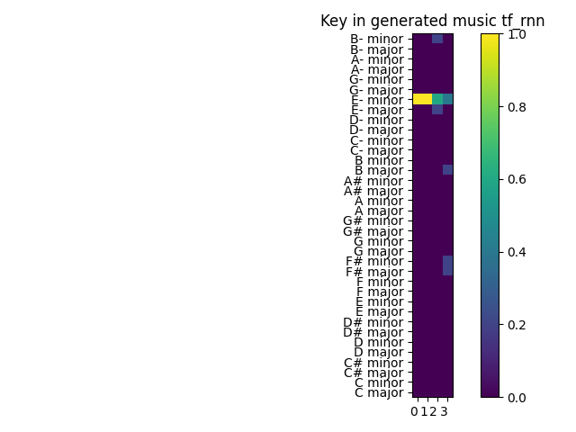

# Miary tonacji

## Zbiory danych
Podczas tworzenia metryki testującej tonację utworów przygotowany został zbiór testowy. Zawiera on pięć utworów w formacie `midi` ze znanymi tonacjami takimi jak `B major, C major, C minor, D major, F major`. Zbiór ten umieszczony został w folderze o nazwie midi_with_keys. Dzieła pozyskane zostały ze strony [Kunstderfuge](https://www.kunstderfuge.com/beethoven/variae.htm), zawierającej darmową muzykę klasyczną w formacie midi. Badania przeprowadzone zostały również na zbiorze [MAESTRO][maestro].
## Opis metryk
Podczas tworzenia miar głównie wykorzystana została biblioteka `music21`. Utworzone zostały funkcje umożliwiające zwracanie tonacji dla całego utworu bądź też listę tonacji dla poszczególnych fragmentów danego utworu. Każda taka funkcja umożliwia wykorzystanie różnych wag dla algorytmu opracowanego przez Krumhansla oraz Schmucklera[^krumh]. Stworzone zostały również funkcje które porównują rezultaty uzyskane pomiędzy algorytmami. Istnieje również możliwość podawania do pewnych funkcji zbiorów danych zamiast pojedynczych utworów. Ponadto stworzona została funkcja porównująca tonacje dwóch utworów i określająca jak podobne są do siebie.
### Algorytm  opracowany przez Krumhansla oraz Schmucklera
Algorytm wyszukiwania kluczy Krumhansl-Schmuckler opiera się na "profilach kluczy". Profil klucza to wektor składający się z 12 wartości, które reprezentują stabilność 12 klas wysokości dźwięku w odniesieniu do danego klucza. Profile kluczy zostały opracowane na podstawie danych z eksperymentów przeprowadzonych przez Krumhansla i Kesslera. W tych eksperymentach badani oceniali, jak dobrze każda klasa wysokości dźwięku "pasuje" do wcześniej ustalonego kontekstu tonacji, takiego jak kadencja lub skala (Krumhansl i Kessler, 1982). Wysoka wartość w profilu klucza wskazuje, że odpowiednia klasa wysokości dźwięku została uznana za dobrze dopasowaną do danej tonacji. Każda z 24 tonacji durowych i molowych ma swój unikalny profil tonacji.
### Wykresy tonacji
wykres przedstawiający tonacje we fragmentach danych utworów oraz porównanie tonacji na przestrzeni danych utworach  ze znanymi tonacjami.

Wykres przedstawiający tonacje na całym utworze oraz znormalizowane tonacje dla całych utworów ze znanymi notacjami.

Kolejne dwa wykresy przedstawiają to samo dla 15 pierwszych utworów ze zbioru maestro.

## Wyniki dla wygenerowanych danych
Na poniższych wykresach można zaobserwować znormalizowaną wartość wykrytych tonacji dla różnych dostępnych algorytmów. Jak można zauważyć funkcje działają również na muzyce wygenerowanej. Za ich pomocą można w łatwy sposób estymować tonacje.

Wykres dla wygenerowanych danych za pomocą GMT

Wykres dla wygenerowanych danych za pomocą MP

Wykres dla wygenerowanych danych za pomocą TF RNN

## Wnioski

## Przyszłe rozszerzenia
W przyszłości będzie można spróbować przyspieszyć działanie funkcji, która odpowiada za dzielenie utworu na części i sprawdzania ich tonacji. Na chwilę obecną wycinanie fragmentu utworu wykonywane jest za pomocą biblioteki midi_clip. Również będzie można dodać inne rozwiązania badające tonacje.  
## Bibliografia

[maestro]: https://magenta.tensorflow.org/datasets/maestro

[^krumh]:  ["Carol L. Krumhansl. Cognitive Foundations of Musical Pitch. New York: Oxford University Press,
1990."]
