# Miary synkopy

W ramach projektu biblioteka [SynPy](https://code.soundsoftware.ac.uk/projects/syncopation-dataset/repository) została przeportowana z Pythona wersji 2 do Pythona wersji 3.
Biblioteka implementuje kilka modeli rozpoznawania synkopy w utworach zapisanych w formacie symbolicznym (MIDI).
Stanowi platformę do analizy synkopy w utworach i ułatwia wyrażenie jej w formacie liczbowym, a także umożliwia porównywanie modeli ze sobą.

## Opis modeli

### Longuet-Higgins and Lee 1984 (LHL)

Model rozkłada strumień dźwięków do struktury drzewiastej, gdzie elementy rytmu występujące wyżej w hierarchii mają wyższą "siłę".
W ten sposób możliwe jest ustanowienie podstawowego wzoru rytmicznego.
Według tego modelu synkopa występuje, gdy po nucie w "słabszej" pozycji występuje przerwa w "silniejszej" pozycji. 

### Pressing 1997 (PRS)

Model analizuje sekwencje rytmiczne w utworze i nadaje każdej sekwencji wynik w zależności od wykrytego wzoru rytmicznego.
Predefiniowane wzory, do których porównywane są sekwencje w utworze, mają z góry ustalony wynik.

### Toussaint 2002 ‘Metric Complexity’ (TMC)

Model definiuje poziom synkopy jako różnicę między zmierzoną złożonością rytmiczną danej sekwencji,
a najmniejszą możliwą złożonością rytmiczną sekwencji składającej się z takiej samej liczby nut.

### Sioros and Guedes 2011 (SG)

Podobnie jak model LHL, ten model stosuje podejście hierarchiczne do analizy sekwencji nut.
W tym modelu poziom synkopy jest wyliczany na podstawie dynamiki oraz położenia analizowanej nuty w hierarchii rytmicznej,
a także położenia nuty poprzedzającej i następującej.

### Toussaint 2005 ‘Off-Beatness’ (TOB)

Nuty synkopowane to te, które występują poza głównym taktem, przy czym takt jest definiowany jako
elementy w sekwencji, które występują w regularnych odstępach czasowych w cyklu.

### Gomez 2005 ‘Weighted Note-to-Beat Distance’(WNBD)

Nuta ma tym wyższą wartośc synkopy, im dalej znajduje się od najbliższego taktu (występuje poza taktem).
Synkopa jest silniejsza, jeśli nuta czasem trwania przekracza kolejny takt.

## Eksperymenty

Poza testami jednostkowymi, sprawdzającymi poprawność nowego wrappera oraz przeportowanego kodu, dokonano weryfikacji modeli na kilku spreparowanych plikach MIDI, zawierających 4 takty bez synkopy (nuty w 'beacie' taktu, niektóre modele mogły znaleźć w nich synkopę) i kilka taktów z różnymi układami nut w off-beacie.
Test miał na celu weryfikację, że modele z SynPy poprawnie wykrywają synkopę i zwracają większe wartości dla dalszych taktów.

Wyniki dla pliku w metrum 4/4 prezentują się następująco (oś x - takty, oś y - zwracana siła synkopy):
|           |           |
|-----------|-----------|
| 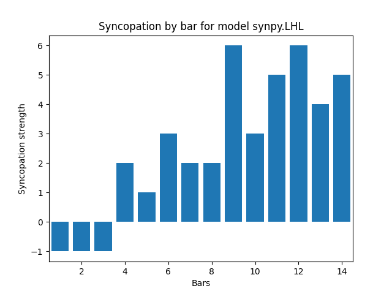 | 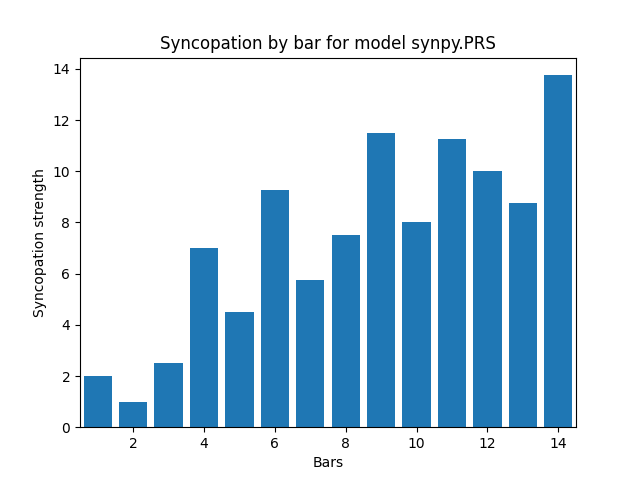 |
| 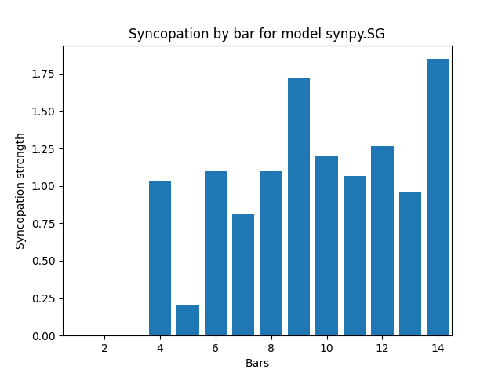 | 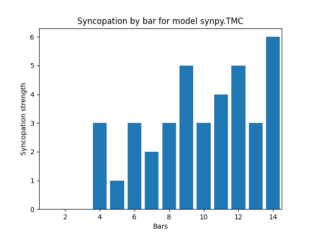 |
| 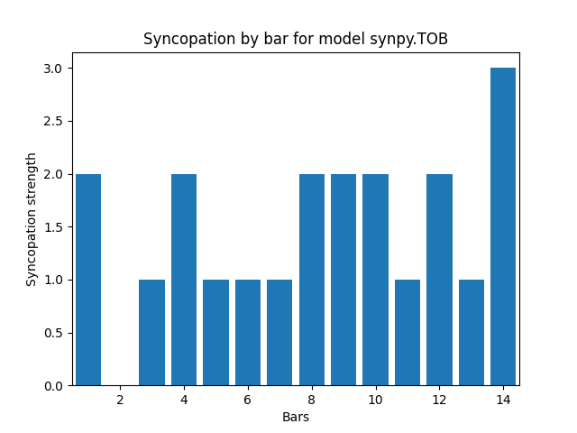 |  |

Dla plików w metrum 4/4 większość modeli wykryła silniejszą synkopę niż spodziewana dla taktu 4 i mniejsza dla 5, jednak poza TOB wartość synkopy dla pierwszych 3 taktów jest niewielka lub żadna, a dla wszystkich dalszych zgodnie z przewidywaniami występuje. Interpretacja każdego z modeli się od siebie nieco różni, co jest spodziewanym rezultatem, gdyż każdy z nich liczy ją w odmienny sposób.

Przetestowano jeszcze analogiczny plik MIDI w metrum 3/4:
|           |           |
|-----------|-----------|
| 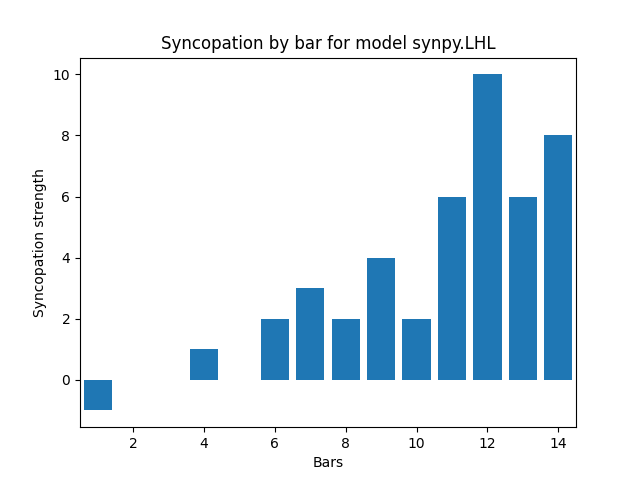 | 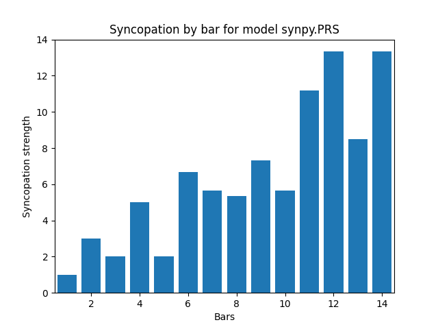 |
| 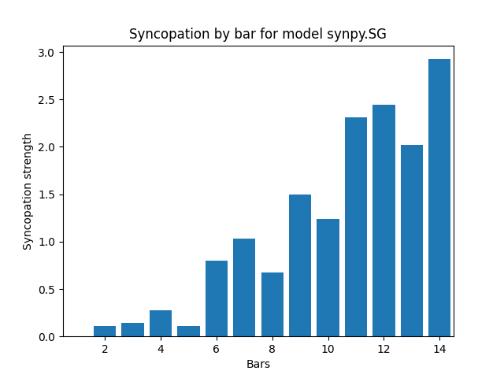 | 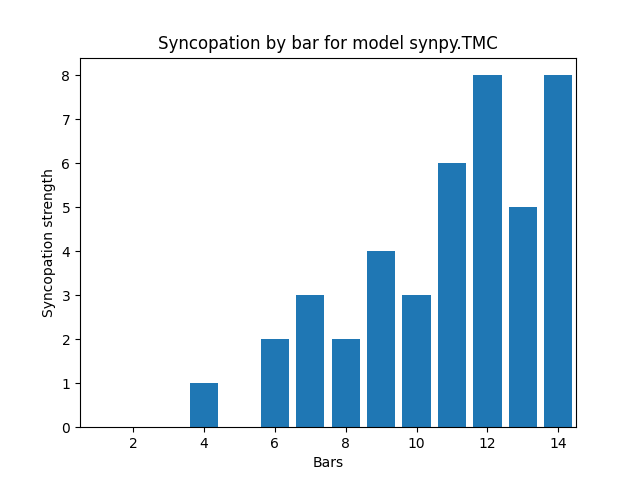 |
| 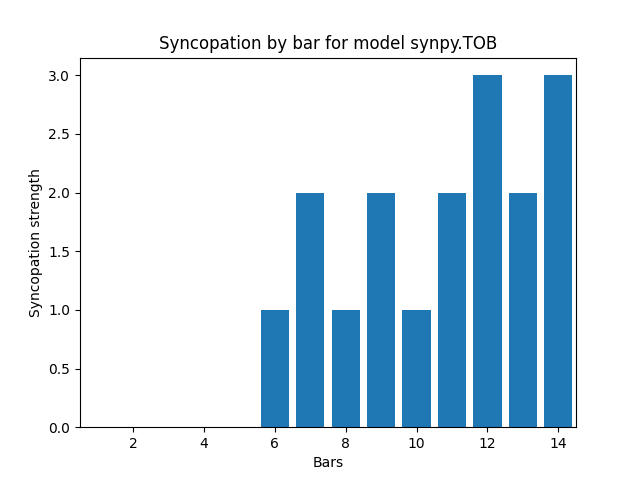 | 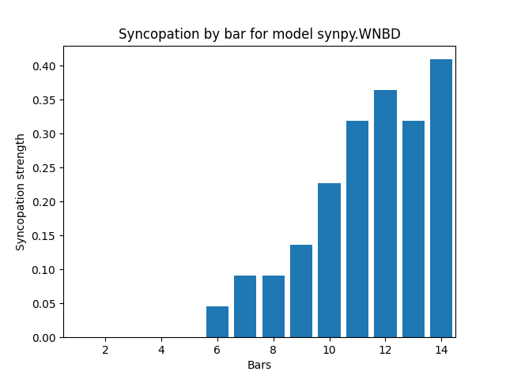 |

Tutaj już widać większe różnice między pierwszymi pięcioma taktami a resztą. Dla tego pliku nawet TOB zwrócił dla nich 0.

Powyższe testy weryfikują poprawność modeli i działanie przeportowanego kodu.

## Przyszłe rozszerzenia

Biblioteka SynPy jest już leciwa i nie posiada integracji z innymi, na przykład MusPy. W przyszłości można by ją rozszerzyć o przyjmowanie jako argumentu obiektów `Music` albo `Track` z MusPy.
Pozwoliłoby to wyjść poza format MIDI do wszystkich, które obsługuje MysPy.

Dodatkowym ograniczeniem jest fakt, że tylko WNBD i TOB obsługują pliki wielościeżkowe. Integracja przyjmująca `Track` mogłaby wyliczyć synkopę dla wybranej ścieżki lub dla wszystkich oddzielnie, umożliwiając użycie pozostałych modeli na wielościeżkowych plikach.

## Bibliografia

Song, Chunyang & Pearce, Marcus & Harte, Christopher. (2015).
[SYNPY: A PYTHON TOOLKIT FOR SYNCOPATION MODELLING](https://www.researchgate.net/publication/344730580_SYNPY_A_PYTHON_TOOLKIT_FOR_SYNCOPATION_MODELLING)
