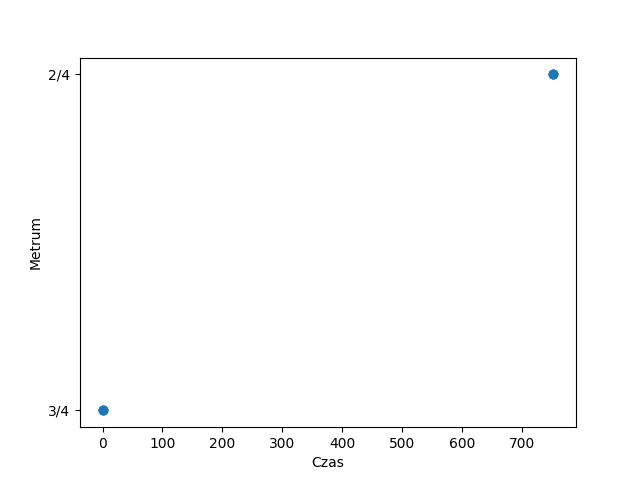
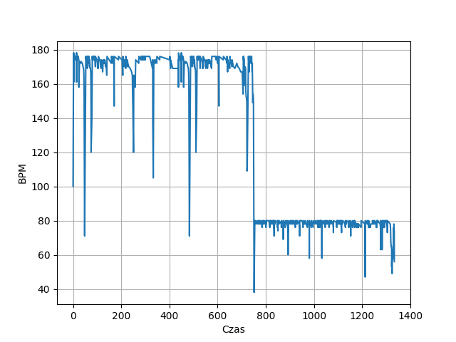

# Metrum i tempo

## Zbiory danych

Przykładowe pliki z rozszerzeniem .mid można pobrać ze strony internetowej https://kunstderfuge.com/

Portal zawiera kompozycje w formacie MIDI wielu znanych kompozytorów, dostępne do pobrania za darmo.

## Opis

### Fundamenty funkcji

Funkcjonalność oparta jest na metodach biblioteki music21.
Zapis metrum można wczytać z pliku MIDI za pomocą metody getTimeSignatures() po uprzednim wypłaszczeniu hierarchii elementów wczytanego pliku.
Tempo zapisane w plikach MIDI jest odczytywane przez bibliotekę jako obiekty klasy MetronomeMark.
Obiekty można wyszukać w pliku za pomocą metody getElementsByClass(). getTimeSignatures() jest skróconą wersją tej metody odpowiednią dla metrum.

### Sposób działania

Z punktu widzenia biblioteki music21 zarówno metrum, jak i tempo są zapisane w obiektach podklas klasy Music21Object.
Można więc wczytywać dane o czasie wystąpienia i wartości tych miar bezpośrednio z plików MIDI.
Głównym działaniem stworzonych funkcji jest wyłuskanie interesujących obiektów ze strumienia informacji po wczytaniu pliku .mid.
Następnie czas wystąpienia obiektu w strumieniu (offset) oraz wartość są zapisywane do osobnych kolekcji, co umożliwia wizualizację danych.

## Wyniki

Poniższe wykresy są przykładowymi wizualizacjami danych zawartych w plikach MIDI, dotyczących metrum i tempa muzyki.
**Wykresy zmian wartości w czasie pomagają w ocenie złożoności analizowanego utworu oraz stanowią prosty sposób na dostęp do kluczowych informacji o kompozycji.**

:::{figure-md}

*Rys. 1. Wykres wartości metrum w czasie dla utworu Ludwiga van Beethovena Sonata e-moll op.90 nr 27*

:::

:::{figure-md}

*Rys. 2. Wykres wartości tempa w czasie dla utworu Ludwiga van Beethovena Sonata e-moll op.90 nr 27*
:::

## Bibliografia

[kunstderfuge.com: The Largest Resource of Classical Music in .mid files](https://kunstderfuge.com/)

[music21 User’s Guide: Chapter 14: Time Signatures and Beats](https://web.mit.edu/music21/doc/usersGuide/usersGuide_14_timeSignatures.html)

[music21.tempo](https://web.mit.edu/music21/doc/moduleReference/moduleTempo.html)